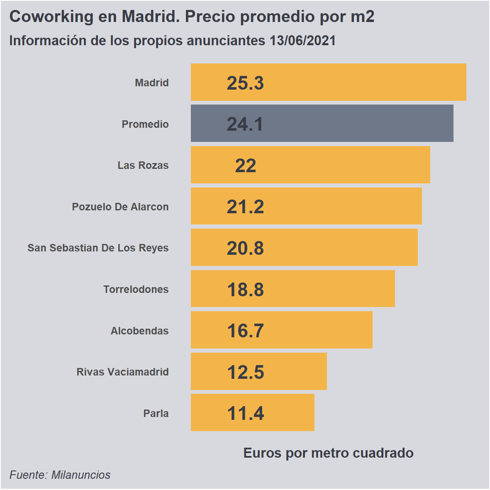

# coworkingMadrid
This project in R does two things:
1. Scrap data from Multianuncios about co working spaces in Madrid, Spain.
2. Creates the average price by zone every week.

### Evolución de los precios del Coworking (may-jul, 2021)

### Precio por metro cuadrado según área de Madrid (jul. 2021)

