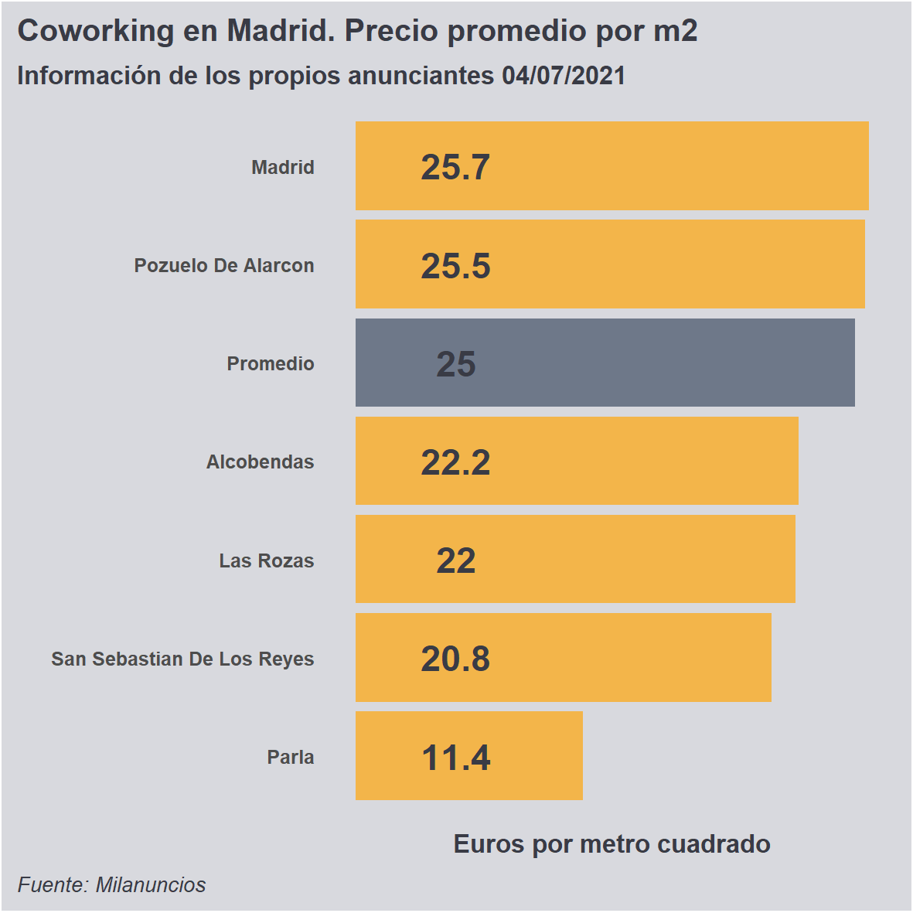

# coworkingMadrid

## Business Question
This project started when my company thought about participating in a joint venture to rent co-working spaces. Information about current prices was needed to take an informed decision, comparing prices based on the location of our building. 

## Data
Most of the offers were in the Spanish portal Milanuncios, so we decided to use it as a source of information. We will create a search in the portal and collect data from each advertisement.

The collected data included district and price in euros by square meter.
Milanuncios is not the only portal that contains this sort of information; however, we do not expect it to be substantially different from the data in other portals. Therefore, our data could be considered a fair sample.To collect the data, a web scrap process was created. This included a try catch function to avoid the complete lost of information. 

The retrieved data had all the information we needed to create a guide of the prices, according to different locations in the city. With them, the CEO could take an informed decision.

## Processing the Data
Once we had an idea of our data, the process of collecting and store them began. We chose R and RStudio because both tools allow us to get the data from the web and assess them in a single process. 

Data were scraped from Milanuncios following a definite pattern:
1. The number of pages to scrap were determined with an initial order that capture the information in the first page of a simulated search result. Afterwards, we created a loop to read the information from the second to the last web page with information.
2. In the same process of collecting the information, the corresponding format (date, numeric, character) was added.
3. A try catch process guarantees that problematic data (incomplete mainly) were discarded.
4. After several tests, all the cleaning process was done inside the script. No additionally operations were needed.

## Final Products
1. Scrap data from Milanuncios about co working spaces in Madrid, Spain.
2. Creates the average price by zone every week.

### Evolución de los precios del Coworking (may-jul, 2021)

### Precio por metro cuadrado según área de Madrid (jul. 2021)

